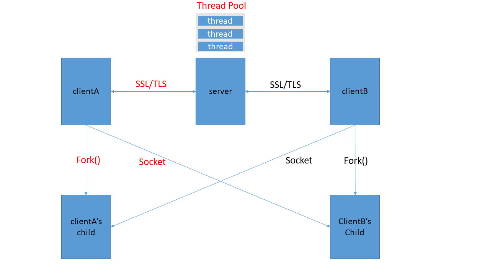

# OpenSSL_Program_Documentation

### Package Version
[OpenSSL@1.1.1i](https://www.openssl.org/)

### Compilation Instructions
1. Open the terminal and navigate to the `./OpenSSL_Program` directory.
2. Execute the `make` command to compile the program.

### Program Execution Instructions
Enter the following command to start the server: `./server ${server port}` \
Enter the following command to start the client: `./client ${server IP address} ${server port}`

### Program Architecture
The server employs multi-threading to create a thread pool, sets up an SSL/TLS connection with incoming clients, and performs a question-and-answer interaction. Additionally, the client generates child processes using the fork() system call, and sets up socket connections with other clients.

